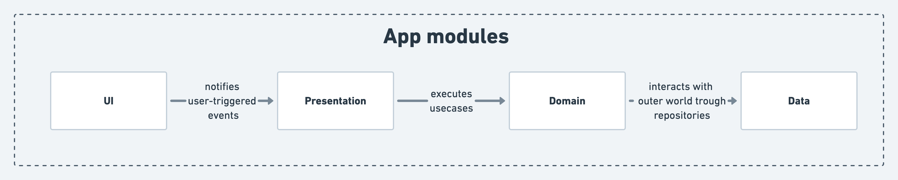
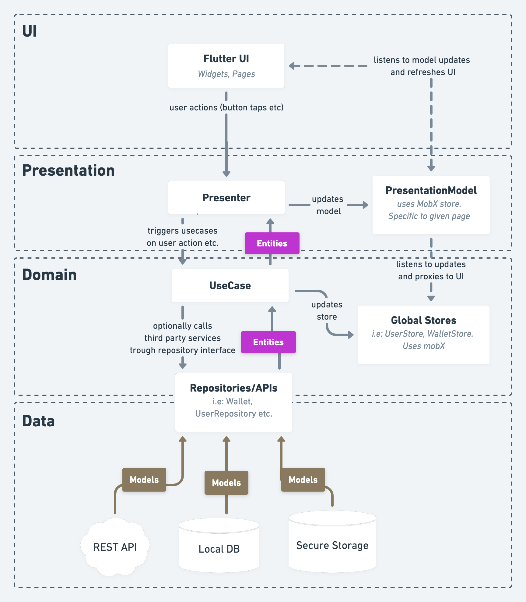
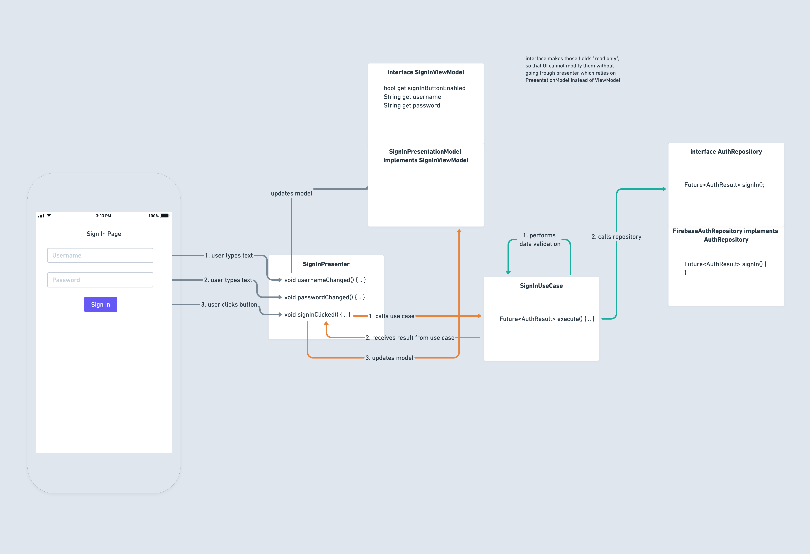

# Flutter app for integrating with Cosmos SDK

This is a sample application for Ethereum based blockchain and Cosmos SDK blockchain which supports basic wallet
management (importing mnemonics), and sending tokens.

## Setup Starport (on `localhost`)

- [Install Starport](https://docs.starport.network/intro/install.html)
- Scaffold a blockchain using `starport app github.com/hello/planet`
- Navigate to `planet` folder and run `starport serve`
- After it is successfully built, you will see two mnemonics for Alice and Bob along with their wallet addresses in the
  terminal

## Setup Ethereum using Ganache (on `localhost`)

- [Install Ganache](https://www.trufflesuite.com/ganache)
- Launch Ganache and run Ethereum environment using Quick Start
- This will launch a local Ethereum network on your system

## Setup (Ethereum Testnet using Ropsten and Infura)

- The application connects to the project created in [Infura](https://infura.io/) Dashboard using Ropsten environment
- You can create your own project and pick up your project ID to be passed as `path` parameter in Flutter runtime
  arguments
- Currently, a sample project ID is already connected to the app (BASE_ETH_URL)

## Setup (Cosmos Hub Testnet)

- The Cosmos Hub Testnet uses publicly hosted links which will be passed as arguments while running the Flutter app

## Setup and run Flutter app

- [Setup Flutter based on your operating system](https://flutter.dev/docs/get-started/install)
- Make sure you follow all the steps above and have an all-green output of `flutter doctor` command.
- [Install and run Anroid Studio once](https://developer.android.com/studio/install)
- (For mac) Install XCode from AppStore
- You can use Android
  Studio, [IntelliJ Idea](https://www.jetbrains.com/idea/download/download-thanks.html?platform=mac&code=IIC),
  or [VSCode](https://code.visualstudio.com/download) for Flutter development
- Install Flutter plugin in your chosen IDE
- Clone this repository using `git clone https://github.com/tendermint/flutter.git`
- To run it on your `localhost` environment, you will just have to run `main.dart` file in your project. That can be
  done directly by clicking on the play button in your IDE, or by running `flutter run` from the root of your project.
  This will run the app on any device or simulator connected to your system.
- To run it on the Cosmos Hub Testnet,
  run `flutter run --dart-define=BASE_LCD_URL=api.testnet.cosmos.network --dart-define=PORT=443 --dart-define=BASE_ETH_URL=https://ropsten.infura.io/v3/96ac5dcb92d545b6a7ffc3d8af21fde0`
  , or add additional
  arguments `--dart-define=BASE_LCD_URL=api.testnet.cosmos.network --dart-define=PORT=443 --dart-define=BASE_ETH_URL=https://ropsten.infura.io/v3/96ac5dcb92d545b6a7ffc3d8af21fde0`
  inside your IDE's configuration for `main.dart` and click on play button.

## Architecture

The app follows clean architecture principles and is divided into 4 modules:



#### UI

UI Module contains flutter widgets, animations, Routes, Pages and all the code that is taking care of how things look
like. This module contains no logic at all, it only takes care of **HOW** things look like.

#### Presentation

Home for `Presenter` and `PresentationModel` classes.

Presenters decide **WHEN** to display things. They take care of triggering business logic from the `domain` module as
well as updating the Presentation Model with relevant data that is then used by the UI.

PresentationModel is storing the data and exposes it to the UI trough the `ViewModel` interfaces. This makes sure the UI
is able to access the data in read-only manner and all internals relevant to presentation is not visible.

#### Domain

`UseCase`, `Repository` and entity classes.

Contains business logic of the application. It decides **WHAT** should be done upon user's interaction with the app. All
the logic is encapsulated into the `UseCase` classes that communicate with the outer world trough Repositories.

Repository interfaces are specified inside the `domain` module and are implemented by the `data` module. All the data
that `domain` operates on is encapsulated into domain entity classes.

#### Data

Takes care of communicating with outer world and interact with third party libraries. Here we specify the REST Apis
interactions, database access, SharedPrefs or external sensor access. All the data is then translated to domain entities
that are agnostic of the libraries and technologies used in order to access them.

### Example

Below you can find a diagram showing the flow of control for a basic scenario of a login page:



## Code best practices & guidelines

### Pull Requests checklist

| Rule | Explanation |
|---|---|
| **Add proper prefix to the PR title (`feat: `, `fix: `, `chore: `, `refactor: `)** | [Link](https://www.conventionalcommits.org/en/v1.0.0/) |
| **review your own PR first** | reading trough your own pr helps spot obvious errors and it saves time for the reviewer |
| **Make sure all CI checks pass** | CI is meant to catch formatting and lint errors, make use of that and don't force others to do the machine's job :) |    
| **Run the app and test it yourself** | Before reviewing a PR or when issuing your own code, make sure to run the app and test it making sure the code doesn't break anything and works correctly |
| **Don't be afraid to ask questions** | Code review is meant not only to find errors in someone's code, but it's also about making sure you understand the code and know what is going on. Don't be afraid to ask questions, if anything looks unclear to you, don't assume that it's your fault, ask a question! :) |

### General

| Rule | Explanation |
|---|---|
| **Use trailing commas for method/constructor parameters and definitions** | This way each param is in a separate line and adding new params is much easier to read in PRs |
| **Prefer named parameters** | Whenever using more than one param, consider using named parameters, i.e: <font color="Red">Bad:</font>`getBalances(true,"1283184")`, <font color="Green">Bad:</font>`getBalances(id: "1283184", refresh: true)` |

### UseCase

- Performs business logic, communicates with outer world trough repositories
- should contain single public `execute()` method optionally with runtime arguments that performs business logic
- all compile-time dependencies should be injected trough constructor
- never use json classes in usecases, always rely communication with APIs trough repositories

### Repository

- Should be specified as an interface in the `domain/repositories` package, i.e: `UserRepository`
- Implementation should be placed in the `data/{tech}` package, i.e: `RestApiUserRepository` in the `data/rest/` package
- It's job is abstract the communication with outer world (APIs, Blockchains, databases, shared prefs).
- Translates the domain models into data models and vice versa. so that use cases can depend solely on the domain
  entities
- Repository methods should always return the response in the form of `Future<Either<Failure,Result>>` type
- the `Result` part needs to be a domain entity or a primitive type, never a json or library-specific class!
    - <font color="Green">Good:</font> `String`, `User`, `int`
    - <font color="Red">Bad:</font> `UserJson`, `FirebaseUser`, `FirebaseAuthResponse`
- the `Failure` should be a class specified in domain entities subfolder (see [Failures](#Failures))

### Failures

- should be stored in `domain/model/failures`
- A specific domain entity that denotes a failure of certain action. Failure should contain a:
    - `type`
    - `cause`
    - `String toString()` method
    - `DisplayableFailure displayableFailure()` method (useful to be able to display a error dialog stating the cause of
      a failure)

#### Example:

```dart

enum VerifyPasscodeFailureType {
  Unknown,
  ValidationError,
}

class SomeFailure {
  // ignore: avoid_field_initializers_in_const_classes
  const SomeFailure.unknown([this.cause]) : type = SomeFailureType.Unknown;

  const SomeFailure.validationError(PasscodeValidationFailure fail)
      : cause = fail,
        type = SomeFailureType.ValidationError;

  final SomeFailureType type;
  final dynamic cause;

  DisplayableFailure displayableFailure() {
    switch (type) {
      case SomeFailureType.Unknown:
        return DisplayableFailure(
          title: strings.failureTitle,
          message: strings.failureMessage,
        );
    }
  }

  @override
  String toString() {
    return 'SomeFailure{type: $type, cause: $cause}';
  }
}
```

### Domain entity

- should be stored in `domain/model`
- domain entities should extend from `Equatable`
- all fields should be final (so that we encourage [immutability](https://en.wikipedia.org/wiki/Immutable_object))
- all fields should be non-nullable unless the null value makes sense in the given context

#### Example:

```dart
class User extends Equatable {
  final String username;


  const User({
    required this.username,
    required this.firstName,
    required this.lastName,
  });

  @override
  List<Object> get props =>
      [
        username,
        firstName,
        lastName,
      ];
}
```

### Presenter

- reacts to user interaction, (i.e: all onTap methods are being forwarded to presenter)
- calls use cases
- updates presentation model with new data
- never accesses initialParams from PresentationModel directly, but through the getters in presentationModel
- does not store any data, all the data that it requires is being held inside the presentationModel
- presenter never needs a `BuildContext`, it's always agnostic of the fact it's used in flutter thus should never rely
  on flutter classes

### ViewModel

- interface that exposes data from presentation model to pages
- contains only getters, views are not supposed to mutate any state directly
- should not expose data that is internal for presenters and should not be used by pages directly

### PresentationModel

- stores data used by presenter and pages
- uses mobx to make all the fields observable
- `*PresentationModelBase` is a base class we use to store mobx boilerplate code
- accepts InitialParams as constructor param

### Page

- never accesses initialParams directly
- routes all the user interaction to presenter, i.e: ```InkWell(onTap: () =>  presenter.onTapLogin()```
- uses `Observer` widget to listen to changes in `ViewModel`
- accesses data to display from `ViewModel` only
- divides the UI into smaller widgets, extracted to a separate files
-

### Json classes

- all fields in `*Json` classes should be nullable
- all fields should be final
- should contain `toDomain()` method that translates the json to domain entity

#### Example:

```dart
class UserJson {
  UserJson({
    required this.username,
    required this.firstName,
    required this.lastName,
  });

  factory UserJson.fromJson(Map<String, dynamic> json) =>
      UserJson(
        username: json['username'] as String? ?? '',
        firstName: json['first_name'] as String? ?? '',
        lastName: json['last_name'] as String? ?? '',
      );

  final String? username;
  final String? firstName;
  final String? lastName;

  Balance toBalanceDomain() =>
      Balance(
        username: username ?? "",
        firstName: firstName ?? "",
        lastName: lastName ?? "",
      );
} 
```

